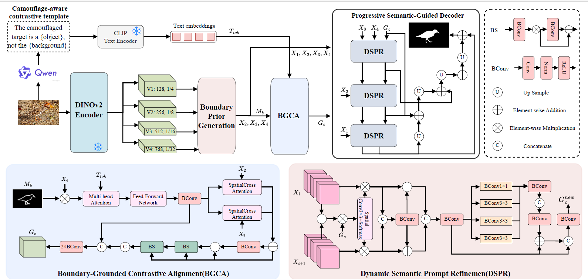

# Learning What It Is Not: Boundary-Grounded Contrastive Prompting for Camouflaged Object Detection

**Under Review at Pacific Graphics (PG) 2026**

## Overview

This repository contains the official PyTorch implementation of **BCPNet** (Learning What It Is Not: Boundary-Grounded Contrastive Prompting for Camouflaged Object Detection
), a novel approach for Camouflaged Object Detection (COD) that leverages boundary-aware contrastive learning and semantic prompting mechanisms.

## Framework



*Figure: The overall architecture of BCPNet. The network consists of Boundary Prior Generation (BPG), Boundary-Grounded Contrastive Alignment (BGCA), and Progressive Semantic Guided Decoder (PSGD) modules.*


## Requirements

### Environment

- Python 3.7+
- PyTorch 1.3.1+
- CUDA 10.0+ (GPU required)
- Linux/Windows

### Dependencies

Install required packages:

```bash
pip install -r requirement.txt
```

The main dependencies include:
- `torch==1.3.1`
- `torchvision==0.4.2`
- `opencv-python==3.4.2.17`
- `tqdm==4.62.3`
- `pysodmetrics==1.3.0`
- `imageio==2.9.0`


## Dataset Preparation

### Dataset Structure

Organize your datasets as follows:

```
BCPNet/
├── data/
│   ├── TrainDataset/
│   │   ├── Imgs/          # Training images
│   │   ├── GT/            # Ground truth masks
│   │   └── Edge/          # Edge/boundary annotations
│   └── TestDataset/
│       ├── CAMO/
│       │   ├── Imgs/
│       │   └── GT/
│       ├── COD10K/
│       │   ├── Imgs/
│       │   └── GT/
│       └── NC4K/
│           ├── Imgs/
│           └── GT/
├── models/
│   └── dinov2/            # DINOv2 pretrained weights
└── ...
```

### Download Datasets

1. **COD10K**
2. **CAMO**
3. **NC4K**

### Download Pretrained Models

1. **DINOv2 Models**
2. **Swin Transformer**
3. **PVT-V2**

Place pretrained weights in the `models/` directory.

## Training

### Basic Training Command

```bash
python train.py \
    --epoch 100 \
    --lr 1e-4 \
    --batchsize 4 \
    --trainsize 448 \
    --testsize 448 \
    --backbone dinov2 \
    --dinov2_variant dinov2_vitb14 \
    --dinov2_ckpt ./models/dinov2/dinov2_vitb14_pretrain.pth \
    --train_path ./data/TrainDataset \
    --test_path ./data/TestDataset \
    --train_save BCPNet_DINOv2
```

### Training with Text Embeddings (Multimodal)

```bash
python train.py \
    --use_text \
    --text_dim 512 \
    --text_hidden_dim 256 \
    --train_text_root /path/to/train/text \
    --test_text_root /path/to/test/text \
    --w_align 0.005 \
    --align_warmup_epoch 5
```

### Training with Different Backbones

**Res2Net:**
```bash
python train.py --backbone res2net --trainsize 384 --testsize 384
```

**Swin Transformer:**
```bash
python train.py \
    --backbone swin \
    --swin_variant swin_b_384_22k \
    --swin_ckpt ./models/swin_base_patch4_window12_384_22k.pth \
    --trainsize 384 \
    --testsize 384
```

**PVT-V2:**
```bash
python train.py \
    --backbone pvt \
    --swin_variant pvt_v2_b2 \
    --trainsize 384 \
    --testsize 384
```

### Advanced Training Options

```bash
python train.py \
    --epoch 100 \
    --lr 1e-4 \
    --optimizer adamw \
    --weight_decay 1e-4 \
    --clip 0.5 \
    --w_pr 1.5 \
    --w_side2 0.4 \
    --w_side3 0.2 \
    --use_swanlab \
    --swanlab_project BCPNet \
    --swanlab_exp_name BCPNet_exp1
```


## Test

### Generate Predictions

```bash
python test.py \
    --pth_path ./checkpoints/BCPNet/BCPNet.pth \
    --save_root ./results/BCPNet \
    --testsize 448
```

This will generate predictions on all test datasets (CAMO, CHAMELEON, COD10K, NC4K).

### Evaluate Results

```bash
python eval.py
```

This computes standard COD metrics:
- **S-measure** (Structure measure)
- **wF-measure** (Weighted F-measure)
- **MAE** (Mean Absolute Error)
- **E-measure** (Enhanced alignment measure)
- **F-measure** (F-measure)

Evaluation results will be saved to `evalresults.txt`.


## Project Structure

```
BCPNet/
├── net/
│   ├── BCPNet.py          # Main network architecture
│   ├── Res2Net.py         # Res2Net backbone
│   ├── ResNet.py          # ResNet backbone
│   ├── swin_backbone.py   # Swin Transformer backbone
│   ├── swin_encoder.py    # Swin encoder
│   └── pvt_v2_eff.py      # PVT-V2 backbone
├── utils/
│   ├── tdataloader.py     # Data loading utilities
│   └── utils.py           # Training utilities
├── train.py               # Training script
├── test.py                # Testing script
├── eval.py                # Evaluation script
├── requirement.txt        # Dependencies
├── checkpoints/           # Model checkpoints
├── data/                  # Datasets
├── models/                # Pretrained weights
├── results/               # Prediction results
└── log/                   # Training logs
```


## Acknowledgements

We thank the authors and contributors of:
- [DINOv2](https://github.com/facebookresearch/dinov2)
- [Swin Transformer](https://github.com/microsoft/Swin-Transformer)
- [PVT](https://github.com/whai362/pvt)
- [py-sod-metrics](https://github.com/lartpang/py-sod-metrics)
